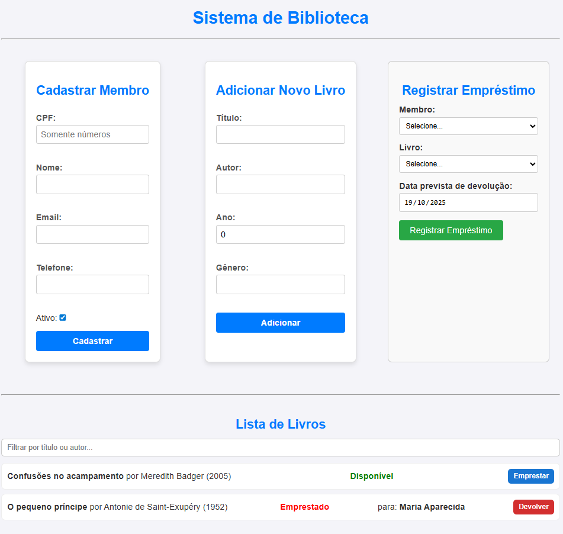

# 📚 Sistema de Biblioteca Full-Stack

Este é um projeto completo de um sistema de gerenciamento de biblioteca, desenvolvido com o objetivo de aplicar e estudar conceitos avançados de arquitetura de software, como os princípios **SOLID**, **Clean Code**, e padrões de design como o **Repository Pattern**.



---

## 🏛️ Arquitetura e Princípios de Design

Este projeto não foi apenas sobre criar funcionalidades, mas sobre como construí-las da maneira certa. A arquitetura foi pensada para ser limpa, modular, e escalável.

### Estrutura de Pastas

O projeto é um monorepo com duas pastas principais: `backend` e `frontend`, cada uma com suas responsabilidades bem definidas.

* **`backend/`**: Contém a API RESTful construída em Node.js.
    * `src/repositorios/`: Camada de Acesso a Dados. A única parte do sistema que sabe como falar com o banco de dados (neste caso, SQLite).
    * `src/services/`: Camada de Serviço (Regras de Negócio). Onde a lógica principal do sistema reside (ex: o que acontece ao emprestar um livro).
    * `src/index.ts`: Ponto de entrada da API, onde o servidor Express é configurado e as rotas são definidas.

* **`frontend/`**: Contém a aplicação de interface do usuário (UI) construída em React.
    * `src/componentes/`: Contém todos os componentes React. Seguindo o Princípio da Responsabilidade Única, cada componente tem um propósito específico (um formulário, uma lista, etc.).
    * `src/models/`: Contém as definições de tipo (interfaces) compartilhadas no frontend, promovendo o princípio DRY (Don't Repeat Yourself).
    * `src/App.tsx`: Componente principal que orquestra a renderização dos outros componentes.

### Princípios Aplicados

* **SOLID**: O guia principal para a arquitetura do projeto.
    * **S - Princípio da Responsabilidade Única (SRP):** Cada classe e componente tem um, e apenas um, motivo para mudar.
        * *Exemplo:* `SQLiteRepositorio` só muda se a forma de acessar o banco de dados mudar. `LivroService` só muda se as regras de negócio para livros mudarem. `FormularioLivro.tsx` só muda se o formulário de cadastro de livros mudar.
* **Clean Code**: Buscamos escrever um código legível, com nomes de variáveis e funções claros, e componentes pequenos e focados.
* **Repository Pattern**: O backend utiliza este padrão para desacoplar a lógica de negócio do acesso a dados. O `LivroService` não sabe se os dados vêm de um SQLite, PostgreSQL ou MongoDB; ele apenas conversa com a interface `IRepositorio`, tornando o sistema flexível a futuras mudanças de banco de dados.
* **Injeção de Dependência**: As dependências (como os repositórios) são "injetadas" nos serviços através de seus construtores. Isso torna o código mais testável e desacoplado.
* **Colocation (CSS Modules)**: No frontend, os estilos de um componente (`.module.css`) são mantidos na mesma pasta que o componente. Isso o torna um "pacote" autossuficiente e evita conflitos de CSS em uma aplicação maior.

---

## 🛠️ Tecnologias e Justificativas

| Tecnologia | Área | Por que foi escolhida? |
| :--- | :--- | :--- |
| **Node.js** | Backend | Um ambiente de execução JavaScript rápido e popular, permitindo o uso de uma única linguagem em todo o projeto (full-stack). |
| **Express.js** | Backend | Um framework minimalista e flexível para Node.js, ideal para construir APIs RESTful de forma rápida e organizada. |
| **TypeScript** | Full-Stack | Adiciona tipagem estática ao JavaScript. Essencial para escrever um código mais seguro, legível e manutenível, facilitando a aplicação de padrões de design e a refatoração. |
| **SQLite** | Backend | Um banco de dados leve, baseado em arquivo e sem necessidade de um servidor separado. Perfeito para desenvolvimento, prototipagem e aplicações de pequeno a médio porte. |
| **React** | Frontend | A biblioteca líder de mercado para construir interfaces de usuário modernas, interativas e baseadas em componentes. |
| **Vite** | Frontend | Uma ferramenta de build de última geração que oferece um servidor de desenvolvimento extremamente rápido (HMR) e um processo de build otimizado para produção. |

---

## 🏁 Começando

Siga os passos abaixo para instalar e rodar o projeto em sua máquina.

### Pré-requisitos

* Node.js (versão LTS, ex: v18.x ou v20.x)
* NPM (já vem com o Node.js)

### Instalação e Execução

1.  **Clone o repositório**
    ```sh
    git clone [https://github.com/Luanagroth/Sistema-Biblioteca.git](https://github.com/Luanagroth/Sistema-Biblioteca.git)
    ```
2.  **Navegue até a pasta do projeto**
    ```sh
    cd Sistema-Biblioteca
    ```
3.  **Instale as dependências do Backend**
    ```sh
    cd backend
    npm install
    ```
4.  **Instale as dependências do Frontend**
    ```sh
    cd ../frontend 
    npm install
    ```
5.  **Execute a Aplicação**
    * Você precisará de **dois terminais** abertos.
    * No **primeiro terminal**, inicie o backend (a partir da pasta `backend`):
        ```sh
        npm run dev
        ```
    * No **segundo terminal**, inicie o frontend (a partir da pasta `frontend`):
        ```sh
        npm run dev
        ```
    * Abra seu navegador e acesse `http://localhost:5173`.

---

## ✨ Funcionalidades

* [x] Cadastro, listagem, edição e exclusão de Livros.
* [x] Cadastro, listagem, edição e exclusão de Membros.
* [x] Sistema completo de Empréstimo e Devolução de livros.
* [x] Interface reativa com atualização de dados em tempo real.
* [x] Filtro dinâmico na lista de livros.

---

## 👤 Contato

**[Luana Eulália Groth]**

* **LinkedIn:** `www.linkedin.com/in/luanagroth`
* **Email:** `luanaeulalia56@gmail.com`
* **GitHub:** `https://github.com/seu-usuario`